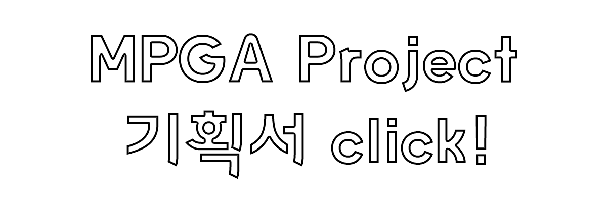
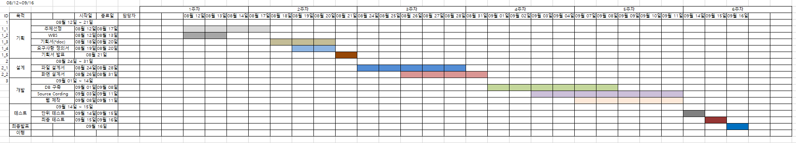
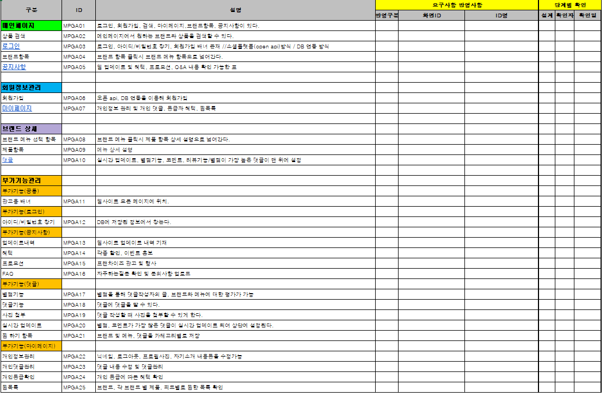
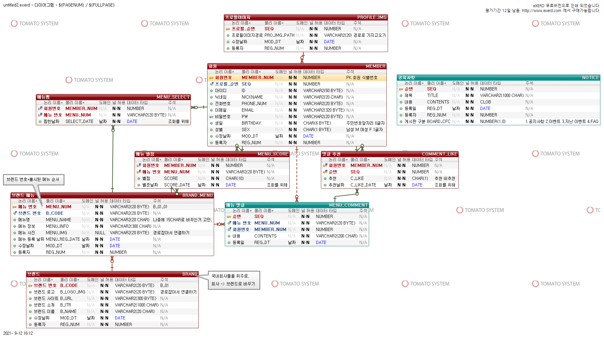
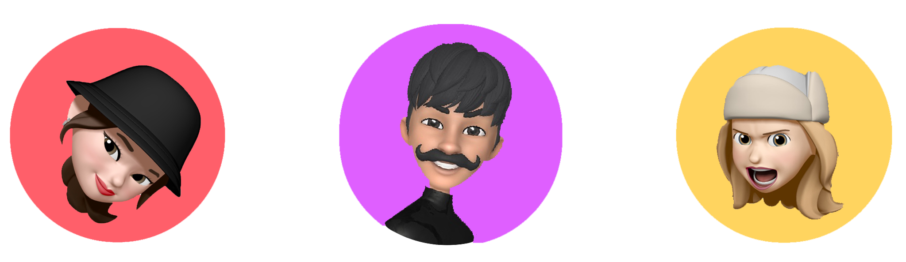

### 00. 프로젝트 목표
+ OracleDB와 DBMS를 사용하여 데이터 구성하고 관리함.
+ JAVA기반의 프레임워크 SpringMVC와 jsp, bootstrap을 사용하여 FULL-STACK 개발자로서의 역량을 개발함.
+ GITHUB를 통해 형상관리기능을 경험해보고 직무수행에 필요한 능력을 기른다.  

### 01. 프로젝트 기획서  
       

### 02. 개발환경
BACK-END  SPRING, JAVA, ORACLE DATABASE, MYBATIS   
FRONT-END  JQUERY, SERVLETS&JSP, BOOTSTRAP  
WEB-SERVER APACHE TOMCAT  
VERSION-CONTROL-SYSTEM GITHUB  
COLLABORATION-TOOL SLACK, ZOOM, ONEDRIVE  

### 03. WBS  
  

### 04. 요구사항 정의서  
   

### 05. EXERD  
  
 

### 06. 팀 소개  
  
&nbsp;&nbsp;&nbsp;&nbsp;&nbsp;&nbsp;&nbsp;&nbsp;&nbsp;&nbsp;&nbsp;김동현&nbsp;&nbsp;&nbsp;&nbsp;&nbsp;&nbsp;&nbsp;&nbsp;&nbsp;&nbsp;&nbsp;&nbsp;&nbsp;&nbsp;&nbsp;&nbsp;&nbsp;&nbsp;&nbsp;&nbsp;&nbsp;&nbsp;&nbsp;&nbsp;&nbsp;&nbsp;&nbsp;&nbsp;&nbsp;&nbsp;&nbsp;&nbsp;&nbsp;&nbsp;&nbsp;김소연 
&nbsp;&nbsp;&nbsp;&nbsp;&nbsp;&nbsp;&nbsp;&nbsp;&nbsp;&nbsp;&nbsp;&nbsp;&nbsp;&nbsp;&nbsp;&nbsp;&nbsp;&nbsp;&nbsp;&nbsp;&nbsp;&nbsp;&nbsp;&nbsp;&nbsp;&nbsp;&nbsp;&nbsp;&nbsp;&nbsp;&nbsp;&nbsp;&nbsp;&nbsp;&nbsp;&nbsp;김정훈    
-------------------------------------------------------------------------
   
## &nbsp;&nbsp;&nbsp;&nbsp;&nbsp;&nbsp;&nbsp;&nbsp;&nbsp;&nbsp;&nbsp;&nbsp;김혜수 &nbsp;&nbsp;&nbsp;&nbsp;&nbsp;&nbsp;&nbsp;&nbsp;&nbsp;&nbsp;&nbsp;&nbsp;&nbsp;&nbsp;&nbsp;&nbsp;&nbsp;&nbsp;&nbsp;&nbsp;&nbsp;&nbsp;&nbsp;&nbsp;&nbsp;&nbsp;&nbsp;&nbsp;&nbsp;&nbsp;&nbsp;&nbsp;조봉준 &nbsp;&nbsp;&nbsp;&nbsp;&nbsp;&nbsp;&nbsp;&nbsp;&nbsp;&nbsp;&nbsp;&nbsp;&nbsp;&nbsp;&nbsp;&nbsp;&nbsp;&nbsp;&nbsp;&nbsp;&nbsp;&nbsp;&nbsp;&nbsp;&nbsp;&nbsp;&nbsp;&nbsp;&nbsp;&nbsp;&nbsp;&nbsp;&nbsp;&nbsp;&nbsp;강석화    

### 07.담당 개발 업무 (과정중입니다.)   
|번호|이름|개발 업무
|:-----|:-----|:-----|
|1     |김동현 | 마이페이지     |
|2     |강석화 | 댓글, 댓글 좋아요     |
|3     |김소연 | 프로필, 브랜드     |
|4     |김정훈 | 로그인 페이지, 공지사항     |
|5     |김혜수 | 브랜드 메뉴     |
|6     |조봉준 | 찜, 메뉴별점    |

